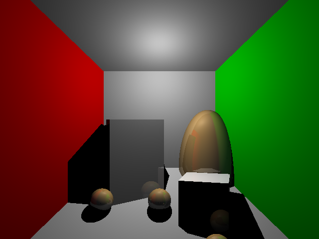

# Simple Raytracer

UC San DiegoX CSE167x Computer Graphics HW3 on edx

### Try it
`note: works only for macOS and linux based systems`
- Step 1 Build :
```sh
$ make
```
- Step 2 choose which scene you want to run:
```sh
scenes
├── scene4-ambient.test
├── scene4-diffuse.test
├── scene4-emission.test
├── scene4-specular.test
├── scene5.test
├── scene6.test
└── scene7.test

1 directory, 7 files
```
- Step 3 run the raytracer:
```sh
$ ./raytracer scenes/scene4-specular.test
```
- Output:
```sh
scenes/scene4-specular.test
0%
2.08333%
4.16667%
...
95.8333%
97.9167%

=======================================
Ray Tracing Complete
=======================================
Completed: scenes/scene4-specular.test 
Output saved at: scene4-specular.png
``` 

### Renders
| | | |
|:-------------------------:|:-------------------------:|:-------------------------:|
|  scene4-ambient.test |   scene4-diffuse.test| scene5.test|
| scene4-ambient.test|   scene6.test| scene7.test|


### handouts
https://cseweb.ucsd.edu/~viscomp/classes/cse167/wi17/assignments/hw4.pdf

https://cs10.berkeley.edu/~cs294-13/fa09/assignments/raytrace.pdf

https://cseweb.ucsd.edu/~alchern/teaching/cse167_fa21/project-raytracing1.pdf

https://cseweb.ucsd.edu/~alchern/teaching/cse167_fa21/project-raytracing2.pdf

https://cseweb.ucsd.edu/~alchern/teaching/cse167_fa21/project-raytracing-bonus.pdf

https://cseweb.ucsd.edu/~alchern/teaching/cse167_fa21/

https://freeimage.sourceforge.io/fnet/html/85BD7B30.htm


image grid: https://gist.github.com/trusktr/93175b620d47827ffdedbf52433e3b37#file-image-grid-md
